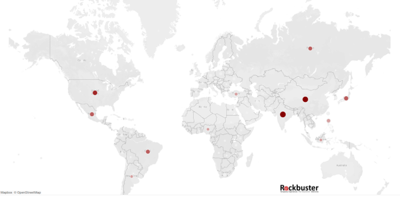

# SQL Analysis for Rockbuster Films

Descriptive analysis based on five business questions posed by executives of a fictitious film company called Rockbuster.

# Project Brief
## Introduction
Rockbuster Stealth LLC i s a movie rental company that used to have stores around the
world. Facing stiff competition from streaming services such as Netflix and Amazon Prime,
the Rockbuster Stealth management team i s planning to use i ts existing movie l icenses to
launch an online video rental service i n order to stay competitive.

## Key Questions
The Rockbuster Stealth Management Board has asked a series of business questions and
they expect data-driven answers that they can use for their 2020 company strategy. Here are
the main questions they’d l ike to answer:
  <ol>
    <li> Which movies contributed the most/least to revenue gain?</li>
    <li> What was the average rental duration for all videos?</li>
    <li> Which countries are Rockbuster customers based in?</li>
    <li> Where are customers with a high lifetime value based?</li>
    <li> Do sales figures vary between geographic regions?</li>
  </ol>
  
## Dataset
Fictitious dataset for Rockbuster films

## Deliverables

Queries

Data dictionary 

Presentation - [Answer to business question 5](https://public.tableau.com/app/profile/kensuke2842/viz/TopCountriesandTotalPayments/BQ5-Top_Countries)

